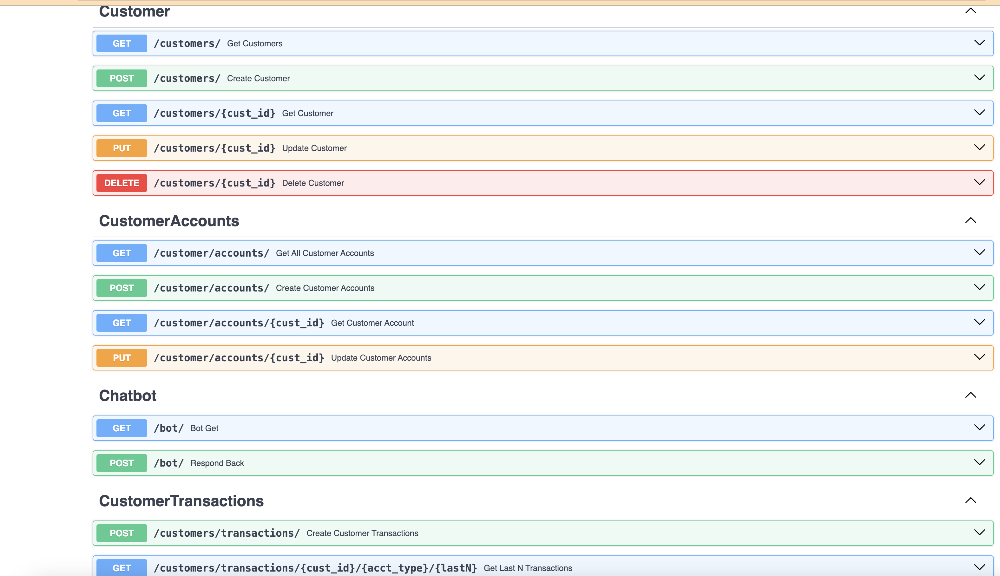

# Banking Assistant
1. Banking Assitant is a kind of simulation chatbot of real world where the user can ask for few Basic Questions like Account Balances, Generic Information, Latest Transactions etc.
2. Install the requirements by using the command
   ` pip install -r requirements.txt `
3. Run the command ` uvicorn run main:app --reload` in the terminal to start the application. The application should be available at http://localhost:8000
4. Available API End points 
5. Create a account on the Google Cloud to access Google Dialog flow. 
6. Import the Banking-Agent.zip file via the Dialog Flow web console after creating the Agent on the Google Dialog Flow. We need to navigate to the Agent Settings (Export and Import tab).Click the button ***Import from Zip***
7. Download the LinkTunnel or ngrok utility to create a secure (i.e. https) tunnel for our application.
8. Open the terminal and run the command `lt --port 8000` to create a secure tunnel for our FastAPI application hosted at port 8000
9. URL would be created as shown here ![Link Tunnel URL][HTTPS_LinkTunnel_URL.png]
10. Set the Fulfillment Webhook to the URL created by the Link Tunnel
11. Please scan through the intents and try interacting with the bot.